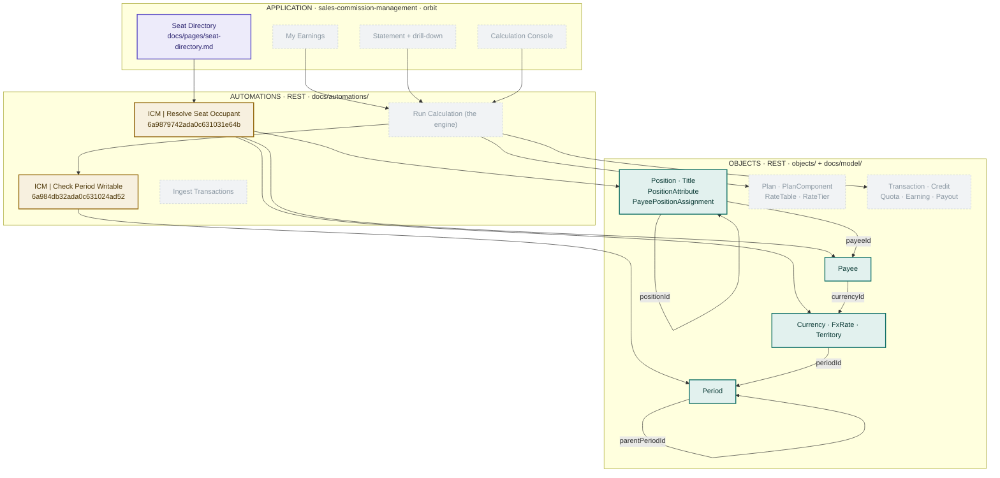

# Architecture — the living map

**One picture of everything: what exists, what is planned, and what calls what.**
This file replaces the old split between `architecture.md` and `PROGRESS.md` —
a map and a status board describing the same assets drift apart, so they are one
file now.

**An asset is not done until it appears here**, updated in the same commit that
builds it. Reading `docs/` start to finish must arrive at the CURRENT state of
the product.

The reason this file must exist: **nothing on the platform records that a page
depends on an automation.** The snapshots know objects and automations; they do
not know pages. If this map is wrong, a contract change breaks a screen and
nobody finds out until a person opens it.

> The ER diagram — which object points at which — stays in
> [docs/model/00-domain-model.md](model/00-domain-model.md). That file changes
> slowly because the product team argues it. This one changes every ship.

---

## Legend

| | meaning |
|---|---|
| **solid green** | live and verified against the platform |
| **solid amber** | exists as a draft, **not deployed** — callers cannot reach it |
| **solid violet** | **specified** — a spec file exists and is agreed; nothing built yet |
| *dashed grey* | planned, not built. No spec file yet unless one is named |

**Nothing is deployed.** Callers only ever reach the deployed copy, so as of
today nothing here is reachable by anything.

---

## The map

The grey nodes are a **sketch from the domain model and the P1 feature list**,
not agreed design. They are here so the shape of the system is visible; each one
becomes real only when it has a spec file.

---

## The register

Every asset that exists, with its id. This is the machine-checkable half.

### Objects — tag `icm`

Created from `objects/*.json` via `scripts/ua-object.mjs`; the snapshots in
`snapshots/orbit/entity-types/` are the truth and this table is the summary.

| name | unique key | lookups out | state |
|---|---|---|---|
| `Period` | `name` | `parentPeriodId` → Period | **live** |
| `Currency` | `code` | — | **live** |
| `FxRate` | — | `currencyId` → Currency · `periodId` → Period | **live** |
| `Territory` | `territoryCode` | — | **live** |
| `Title` | `titleCode` | — | **live** |
| `Position` | `positionCode` | — | **live** |
| `PositionAttribute` | — | `positionId` → Position · `titleId` → Title · `territoryId` → Territory | **live** |
| `Payee` | `employeeId` | `currencyId` → Currency · `userId` → USER | **live** |
| `PayeePositionAssignment` | — | `payeeId` → Payee · `positionId` → Position | **live** |

Every unique key above is a real Mongo index: a duplicate throws E11000 at RUN
time and kills the run, so every create path needs a pre-check and a
`DUPLICATE_*` status.

**Where a unique key is deliberately absent** — `PositionAttribute`,
`PayeePositionAssignment`, `FxRate` — it is because the invariant that matters
is "no OVERLAPPING date ranges", which Mongo cannot express. Those are
automation guards with their own statuses and their own regression cases, or
they are not enforced at all.

**Naming:** object names carry **no prefix** — `Payee`, not `icmPayee` — and
fields are camelCase. Membership is by the `icm` **tag**, never by name.
(`icmPeriod` was the first attempt and is being retired.)

**Everything that names a currency uses a LOOKUP**, not a three-letter string,
so a typo cannot create a second currency that sums separately. Same for
territory, which credit rules match on.

### Automations — tag `icm`

| name | id | reads | called by | state |
|---|---|---|---|---|
| ICM \| Check Period Writable | `6a984db32ada0c631024ad52` | `Period` | nothing yet | **draft**, no spec, no suite |
| ICM \| Resolve Seat Occupant | `6a9879742ada0c631031e64b` | `Position`, `PayeePositionAssignment`, `Payee`, `Currency` | Seat Directory (specified, not built) | **draft**, spec + 24-case suite |

### Pages — app `sales-commission-management`

<https://orbit.uat.unifyapps.com/p/0/interfaces/sales-commission-management>

| page | calls | state |
|---|---|---|
| Seat Directory | `ICM \| Resolve Seat Occupant` | **specified** (`docs/pages/seat-directory.md`), not built |

### Throwaway assets — tag `icmkit-test`, safe to delete

| name | why it exists |
|---|---|
| `KitTestNumeric` (object) | the numeric-type probe that answered open question 8 |
| `ICM KIT TEST \| Numeric probe` | the workflow that read those rows into Groovy |

Both are finished with. They carry the test tag, never `icm`, so no product
script sees them — but they should be deleted, and deleting needs a human yes.

## Now / Next

**Now**

1. **`Payee.currency` and `PositionAttribute.territory` are DEAD fields.** Both
   were retyped into lookups the only way the kit allows — by adding
   `currencyId` / `territoryId` beside them — because `ua-schema.mjs` never
   retypes and the platform refuses to retype a property once an object has
   records. The old `currency` is **still marked `required`**, so every write to
   `Payee` must fill a field nothing reads. This is not cosmetic debt; it blocks
   creates. Two ways out, and it needs a human decision:
   *recreate `Payee` and `PositionAttribute` cleanly* (they are hours old and
   carry only `KITFIX-` fixtures — cheap now, expensive once real data lands),
   or *keep filling the dead field forever*.
2. **Deploy `Resolve Seat Occupant`**, once its suite is green and a human says
   yes. Nothing can call it until then — callers only reach the deployed copy.
3. **Give `Check Period Writable` a spec and a suite.** It is the guard every
   money write will call, and it is still the oldest unfinished thing here.
4. **Retire `icmPeriod`** — zero dependents, one delete call, needs approval.
5. **Answer open question 1 of the Seat Directory spec**: how a page gets a
   pick-list of seats without reaching around a callable. It is the first real
   test of how absolute the layer rule is.

**Next**

The plan objects (`Plan`, `PlanComponent`, `RateTable`, `RateTier`) and the
first object that carries an amount — which is now unblocked, because the
numeric-type question is answered.

**Done**

- **2026-09-03 — the money question is settled, and the seat model is real.**
  A probe found that a storage `number` returns a `BigDecimal` below 10^7 and a
  `Double` at or above it (₹1 crore), with `integer` widening to `Long` past
  `Integer.MAX_VALUE` — so amounts are `number` + a `dec()` coercion, and money
  never goes in an integer field. Eight objects created from versioned specs,
  seat-centric and lookup-typed. One 19-node callable built, validate + lint
  clean, with a spec, a 24-case suite and a fixture family. Three scripts added
  (`ua-object.mjs`, `fixtures.mjs`, `field-types.mjs`); `ua-schema.mjs` learned
  lookups and `regress.mjs` learned `entityFind`.
- **2026-09-02 — the toolchain is proven end to end.** Object created, an
  automation created *with all its nodes in a single API call* and test-run
  green on every branch, and the page-builder MCP server running locally against
  orbit. Six open questions answered; five new runtime facts recorded, including
  the `groupId` branch-path trap that silently prunes nodes.

## Layer rules

**Pages never touch objects directly.** A page calls a callable; the callable
reads and writes. Not style — authorization lives in the callable, so a page
reaching around it is a page that can show somebody else's pay.

**Shared logic is a callable, not a copy.** `Check Period Writable` is the
worked example: every write carrying a `periodId` calls it. When the same check
appears in a second automation, it becomes a callable then, not later.

**Automations are the only writers.** Ad hoc record writes through
`/api/entity/create-update-or-delete/hierarchical` are for fixtures and
debugging only, and never against real pay data.

---

## Keeping this file true

Three sources, in order of authority:

1. **`snapshots/orbit/`** — what the platform actually holds. When this file and
   a snapshot disagree, **the snapshot is right and this file is the bug.**
2. **`snapshots/orbit/automations/REGISTRY.md`** — generated from the platform
   (`ua.mjs registry --tag icm`), listing every callable's real inputs and
   outputs.
3. **`docs/pages/`** — the only record of page dependencies. Nothing generates
   it; it is written by hand or it does not exist.

Start every working session with `ua.mjs drift --tag icm`.
