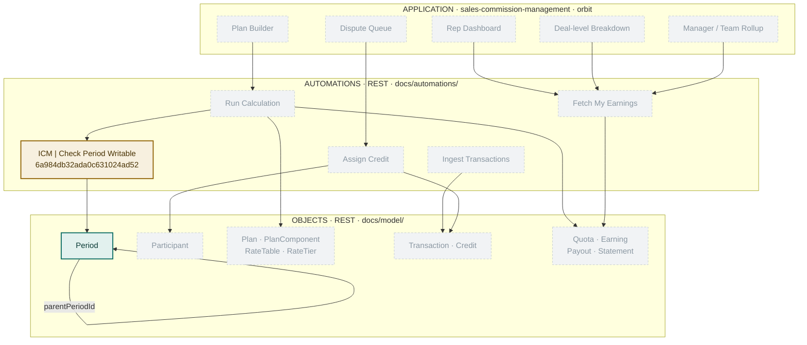

# Architecture — the living map

**One picture of everything: what exists, what is planned, and what calls what.**
This file replaces the old split between `architecture.md` and `PROGRESS.md` —
a map and a status board describing the same assets drift apart, so they are one
file now.

**An asset is not done until it appears here**, updated in the same commit that
builds it. Reading `docs/` start to finish must arrive at the CURRENT state of
the product.

The reason this file must exist: **nothing on the platform records that a page
depends on an automation.** The snapshots know objects and automations; they do
not know pages. If this map is wrong, a contract change breaks a screen and
nobody finds out until a person opens it.

> The ER diagram — which object points at which — stays in
> [docs/model/00-domain-model.md](model/00-domain-model.md). That file changes
> slowly because the product team argues it. This one changes every ship.

---

## Legend

| | meaning |
|---|---|
| **solid green** | live and verified against the platform |
| **solid amber** | exists as a draft, **not deployed** — callers cannot reach it |
| *dashed grey* | planned, not built. No spec file yet unless one is named |

**Nothing is deployed.** Callers only ever reach the deployed copy, so as of
today nothing here is reachable by anything.

---

## The map

The grey nodes are a **sketch from the domain model and the P1 feature list**,
not agreed design. They are here so the shape of the system is visible; each one
becomes real only when it has a spec file.

---

## The register

Every asset that exists, with its id. This is the machine-checkable half.

### Objects — tag `icm`

| name | id | fields | state |
|---|---|---|---|
| `Period` | `Period` | `name`* · `periodType` · `startDate` · `endDate` · `status` · `parentPeriodId` → self | **live** |

\* `name` is a real Mongo unique index. A duplicate throws E11000 at RUN time
and kills the run, so every create path needs a pre-check and a `DUPLICATE_*`
status.

**Naming:** object names carry **no prefix** — `Period`, not `icmPeriod`.
Membership is by the `icm` **tag**, never by name. (`icmPeriod` was the first
attempt and is being retired.)

### Automations — tag `icm`

| name | id | reads / writes | called by | state |
|---|---|---|---|---|
| ICM \| Check Period Writable | `6a984db32ada0c631024ad52` | reads `Period` | nothing yet | **draft**, no spec, no suite |

### Pages — app `sales-commission-management`

<https://orbit.uat.unifyapps.com/p/0/interfaces/sales-commission-management>

| page | calls | state |
|---|---|---|
| — | — | none built |

---

## Now / Next

**Now**

1. **The P1 design.** 18 features from the product sheet, waiting to be
   decomposed into objects, callables and pages.
2. **Retire `icmPeriod`.** Zero dependents; needs one delete call
   (`POST /api/entity-type/delete/icmPeriod`) that requires human approval.
3. **Give `Check Period Writable` a spec and a suite**, then it can deploy. It
   is the guard everything that writes money will call, so it should be the
   first thing that is genuinely finished.

**Next**

The first vertical slice that proves the whole stack: one object, the callable
that guards it, its suite, and one page that reads it — end to end, deployed.

**Done**

- **2026-09-02 — the toolchain is proven end to end.** Object created, an
  automation created *with all its nodes in a single API call* and test-run
  green on every branch, and the page-builder MCP server running locally against
  orbit. Six open questions answered; five new runtime facts recorded, including
  the `groupId` branch-path trap that silently prunes nodes.

---

## Layer rules

**Pages never touch objects directly.** A page calls a callable; the callable
reads and writes. Not style — authorization lives in the callable, so a page
reaching around it is a page that can show somebody else's pay.

**Shared logic is a callable, not a copy.** `Check Period Writable` is the
worked example: every write carrying a `periodId` calls it. When the same check
appears in a second automation, it becomes a callable then, not later.

**Automations are the only writers.** Ad hoc record writes through
`/api/entity/create-update-or-delete/hierarchical` are for fixtures and
debugging only, and never against real pay data.

---

## Keeping this file true

Three sources, in order of authority:

1. **`snapshots/orbit/`** — what the platform actually holds. When this file and
   a snapshot disagree, **the snapshot is right and this file is the bug.**
2. **`snapshots/orbit/automations/REGISTRY.md`** — generated from the platform
   (`ua.mjs registry --tag icm`), listing every callable's real inputs and
   outputs.
3. **`docs/pages/`** — the only record of page dependencies. Nothing generates
   it; it is written by hand or it does not exist.

Start every working session with `ua.mjs drift --tag icm`.
